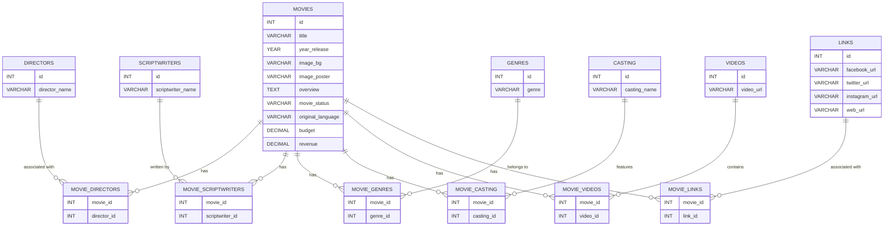

# Backend
La base de datos que utilizaremos esta desarrollada en MySQL, siguiendo el siguiente esquema:

```mermaid
erDiagram
    MOVIES {
        INT id
        VARCHAR title
        YEAR year_release
        VARCHAR image_bg
        VARCHAR image_poster
        TEXT overview
        VARCHAR movie_status
        VARCHAR original_language
        DECIMAL budget
        DECIMAL revenue
    }
    GENRES {
        INT id
        VARCHAR genre
    }
    DIRECTORS {
        INT id
        VARCHAR director_name
    }
    SCRIPTWRITERS {
        INT id
        VARCHAR scriptwriter_name
    }
    CASTING {
        INT id
        VARCHAR casting_name
    }
    VIDEOS {
        INT id
        VARCHAR video_url
    }
    LINKS {
        INT id
        VARCHAR facebook_url
        VARCHAR twitter_url
        VARCHAR instagram_url
        VARCHAR web_url
    }
    MOVIE_DIRECTORS {
        INT movie_id
        INT director_id
    }
    MOVIE_SCRIPTWRITERS {
        INT movie_id
        INT scriptwriter_id
    }
    MOVIE_GENRES {
        INT movie_id
        INT genre_id
    }
    MOVIE_CASTING {
        INT movie_id
        INT casting_id
    }
    MOVIE_VIDEOS {
        INT movie_id
        INT video_id
    }
    MOVIE_LINKS {
        INT movie_id
        INT link_id
    }

    MOVIES ||--o{ MOVIE_DIRECTORS: "has"
    DIRECTORS ||--o{ MOVIE_DIRECTORS: "associated with"
    
    MOVIES ||--o{ MOVIE_SCRIPTWRITERS: "has"
    SCRIPTWRITERS ||--o{ MOVIE_SCRIPTWRITERS: "written by"
    
    MOVIES ||--o{ MOVIE_GENRES: "has"
    GENRES ||--o{ MOVIE_GENRES: "belongs to"
    
    MOVIES ||--o{ MOVIE_CASTING: "has"
    CASTING ||--o{ MOVIE_CASTING: "features"
    
    MOVIES ||--o{ MOVIE_VIDEOS: "has"
    VIDEOS ||--o{ MOVIE_VIDEOS: "contains"
    
    MOVIES ||--o{ MOVIE_LINKS: "has"
    LINKS ||--o{ MOVIE_LINKS: "associated with"
```
